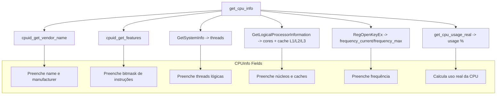

# Módulo CPU

O módulo **CPU** do sistema é responsável por coletar informações detalhadas sobre o processador do computador, incluindo modelo, fabricante, número de núcleos, cache, frequência, instruções suportadas e uso atual da CPU. Ele é implementado de forma multiplataforma, mas atualmente foca na plataforma **Windows**, utilizando APIs nativas do sistema.

---

## Arquivos do módulo

* `cpu.h` — Cabeçalho do módulo, define a estrutura `CPUInfo` e constantes de instruções suportadas (SSE, SSE2, SSE3, AVX, AVX2).
* `cpu.c` — Implementa as funções para coletar informações da CPU.

---

## Estrutura principal

### `CPUInfo`

```c
typedef struct {
    char name[128];           // Nome/Modelo da CPU
    char manufacturer[64];    // Fabricante da CPU
    int cores;                // Número de núcleos físicos
    int threads;              // Número de threads lógicas
    int l1_cache_kb;          // Cache L1 em KB
    int l2_cache_kb;          // Cache L2 em KB
    int l3_cache_kb;          // Cache L3 em KB
    double frequency_current; // Frequência atual em MHz
    double frequency_max;     // Frequência máxima em MHz
    unsigned int features;    // Bitmask de instruções suportadas
    double usage;             // Uso atual da CPU em %
} CPUInfo;
```

Essa estrutura armazena todas as informações essenciais do processador.

---

## Funções principais

### `CPUInfo get_cpu_info(void)`

Retorna um objeto `CPUInfo` preenchido com as seguintes informações:

1. **Nome e fabricante**
   Obtidos via instrução `CPUID` e funções auxiliares internas (`cpuid_get_vendor_name`).

2. **Instruções suportadas**
   Detecta se a CPU suporta conjuntos de instruções como SSE, SSE2, SSE3, AVX e AVX2 utilizando `CPUID`.

3. **Threads e núcleos**

   * Número de threads lógicas: obtido via `GetSystemInfo`.
   * Número de núcleos físicos: obtido via `GetLogicalProcessorInformation`.

4. **Cache L1/L2/L3**
   Calculado com base nas informações retornadas pelo `GetLogicalProcessorInformation`.

5. **Frequência**
   Frequência atual e máxima obtida do registro do Windows (`~MHz`).

6. **Uso atual da CPU**
   Calculado por `get_cpu_usage_real()` usando a função `GetSystemTimes` do Windows. Essa função mede a diferença de tempo entre idle, kernel e user para calcular o percentual de uso real da CPU.

---

### `double get_cpu_usage_real(void)`

Calcula o **uso real da CPU**:

* Utiliza a API `GetSystemTimes` para coletar os tempos de idle, kernel e user da CPU.
* Na primeira execução, faz uma pausa de 500ms (`Sleep`) para ter uma medição de diferença entre dois instantes.
* Calcula o percentual de uso usando a fórmula:

$$
\text{uso} = \frac{\text{total - idle}}{\text{total}} \times 100
$$

---

### Constantes de instruções

O módulo define **bitmasks** para identificar instruções suportadas:

| Constante  | Significado |
| ---------- | ----------- |
| `CPU_SSE`  | SSE         |
| `CPU_SSE2` | SSE2        |
| `CPU_SSE3` | SSE3        |
| `CPU_AVX`  | AVX         |
| `CPU_AVX2` | AVX2        |

Essas constantes são usadas para preencher o campo `features` da estrutura `CPUInfo`.

---

## Observações

* O módulo é **Windows-only**, mas poderia ser estendido para Linux/macOS usando `/proc/cpuinfo` ou sysctl.
* A função `get_cpu_usage_real()` precisa de uma pequena pausa para calcular corretamente o uso real.
* É recomendável chamar `get_cpu_info()` uma vez para inicializar e depois atualizar periodicamente o `usage` via `get_cpu_usage_real()`.




---

### Explicação do diagrama

1. **Função principal**: `get_cpu_info()`

   * Responsável por reunir todas as informações da CPU em um único objeto `CPUInfo`.

2. **Coleta de dados**:

   * `cpuid_get_vendor_name()`: obtém **nome e fabricante** via instrução CPUID.
   * `cpuid_get_features()`: obtém **instruções suportadas** (SSE, AVX, etc.).
   * `GetSystemInfo()`: coleta **número de threads lógicas**.
   * `GetLogicalProcessorInformation()`: coleta **núcleos físicos e caches**.
   * Registro (`~MHz`): obtém **frequência atual e máxima**.
   * `get_cpu_usage_real()`: mede o **uso atual da CPU em %**.

3. **Resultado final**:

   * Todos os dados populam a estrutura `CPUInfo`, que é retornada para uso no restante do sistema.
